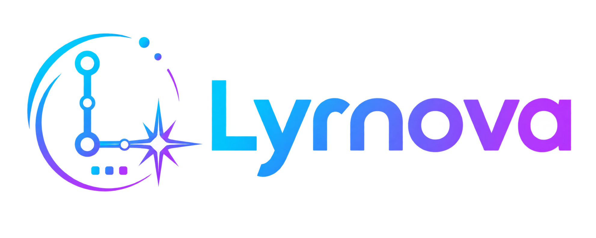

<p align="center">
  
</p>

<p align="center">
  IDE desktop multiplataforma, extensível e seguro, construído com Rust e Tauri.
</p>

<p align="center">
  <strong>Em desenvolvimento inicial.</strong>
</p>

## Sobre

Lyrnova é um IDE desktop comunitário. Ele reúne projetos, Explorer, edição
inteligente, Git, diff, terminal, tasks, testes e depuração em uma interface
própria. Linguagens, runtimes, frameworks e provedores de IA são plugins
instalados e ativados pelo usuário.

O núcleo não depende de Codex, OpenAI ou outro serviço de IA. A instalação
inicial não inclui o Codex e o IDE continua completamente utilizável sem conta,
API key ou provider remoto.

## Tecnologia

- Rust como núcleo nativo;
- Tauri 2 para a interface local e integrações de desktop;
- Monaco Editor empacotado localmente para edição, cores e autocomplete;
- WebKitGTK no Linux e WebView2 no Windows;
- plataforma de plugins para linguagens, LSP, DAP, templates, tasks e IA;
- processos de plugins isolados e APIs mediadas pelo núcleo;
- permissões e approvals antes de efeitos sensíveis;
- frontend empacotado, sem recursos web remotos.

## Plugins

O catálogo e os releases de plugins serão hospedados no GitHub. Cada pacote
terá manifesto versionado, origem, compatibilidade, capabilities, permissões e
checksum verificáveis. Instalação, ativação, desativação, atualização e
desinstalação serão controladas pelo gerenciador do Lyrnova.

Plugins de linguagem poderão fornecer syntax highlighting, tokens semânticos,
LSP/autocomplete, DAP/debug, templates, tasks, testes e toolchains. Plugins de
IA poderão fornecer autenticação, modelos, chat, ferramentas e approvals sem
entrar no núcleo do IDE.

Primeira coleção planejada:

- linguagens e runtimes: Rust, Angular, React, Node.js e C/C++;
- provedores de IA opcionais: Codex e Gemini.

O catálogo embutido atual é somente uma base local de desenvolvimento. Nenhum
download ou publicação de plugin é realizado nesta fase.

## Plataformas planejadas

- Windows;
- Fedora;
- Debian;
- Ubuntu;
- openSUSE;
- Lyra OS;
- OpenBase.

Cada plataforma receberá um pacote próprio e usará, sempre que possível, seu
gerenciador nativo para instalação e atualizações.

## Estado do projeto

O projeto está na fase de fundação funcional. O workspace Tauri 2 já oferece
criação e abertura nativa de projetos, Explorer, Monaco Editor, abas, syntax e
autocomplete, operações Git locais, terminal e painéis redimensionáveis. A
plataforma de plugins e sua tela de gerenciamento estão em implementação.

A integração experimental com Codex App Server está sendo movida para um
plugin opcional. Ela não representa uma dependência nem o propósito central do
produto e ficará ausente da instalação inicial.

## Arquitetura

O frontend local apresenta projetos, editor, Explorer, Git/diff, gerenciador de
plugins e terminal. O núcleo Rust é responsável por workspaces, documentos,
persistência, processos, permissões e Git. Plugins pedem capabilities pelas
APIs do Lyrnova; somente o núcleo concede autoridade e executa efeitos.

- [Escopo e não objetivos](docs/product/scope.md)
- [Decisões arquiteturais](docs/architecture/)
- [Threat model](docs/security/threat-model.md)
- [Design system](docs/design-system.md)

## Desenvolvimento local

No Linux, são necessários Rust stable, Node.js 24, GTK 3 e WebKitGTK 4.1. Com
as dependências do sistema instaladas:

```bash
npm ci --prefix ui
npm run build --prefix ui
cargo test --workspace
cargo run -p lyrnova
```

Os testes normais são locais e não precisam de conta, API key ou rede. Testes
de providers são opcionais, isolados e nunca requisito para validar o IDE.

Consulte [CONTRIBUTING.md](CONTRIBUTING.md) antes de alterar capabilities,
protocolo, filesystem, processos ou integrações nativas.

## Independência

Lyrnova é um projeto comunitário independente. Não é produzido, endossado nem
suportado pela OpenAI, Google ou pelos mantenedores das tecnologias disponíveis
como plugins. As marcas citadas pertencem aos respectivos titulares.

## Licença

O código autoral do Lyrnova é distribuído exclusivamente sob a GNU General
Public License versão 3 (`GPL-3.0-only`). Dependências e componentes de
terceiros permanecem sob suas respectivas licenças.
